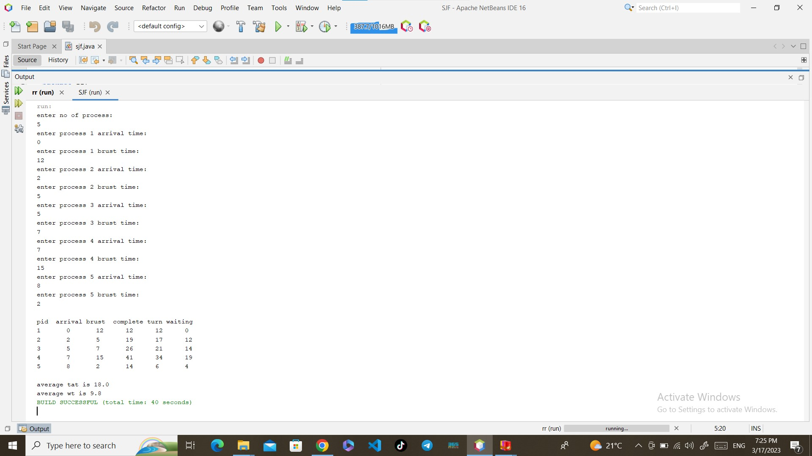
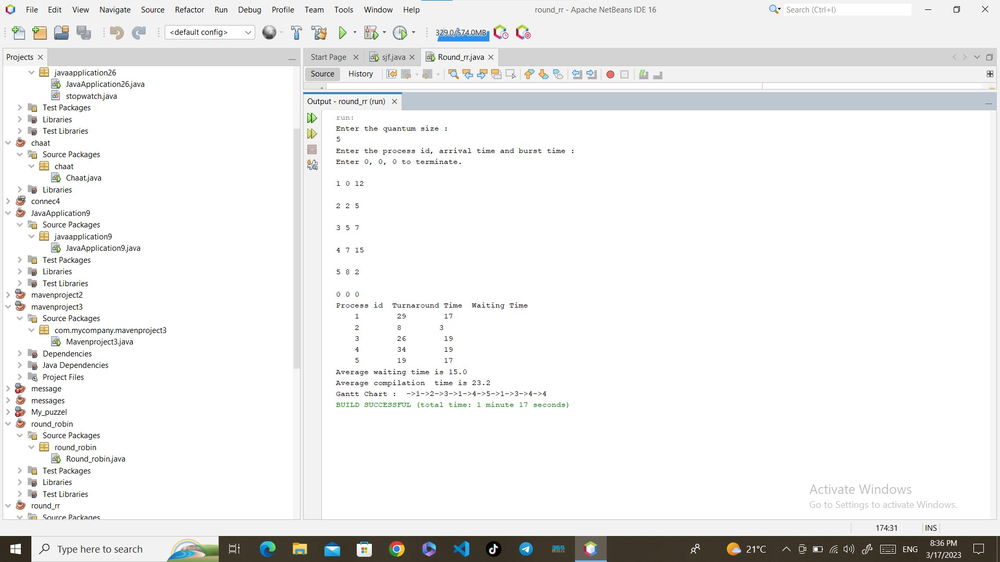

# CPU Scheduling Algorithms SJF and RR Implementation using Java
This project contains Java implementations of two CPU scheduling algorithms:  Shortest-Job-First (SJF) and RoundRobin (RR).

##SJF
The shortest job first (SJF) or shortest job next, is a scheduling policy that selects the waiting process with the smallest execution time to execute next. SJN, also known as Shortest Job Next (SJN), can be preemptive or non-preemptive.

##RR
Round Robin is a CPU scheduling algorithm where each process is assigned a fixed time slot in a cyclic way. It is basically the preemptive version of First come First Serve CPU Scheduling algorithm. 

